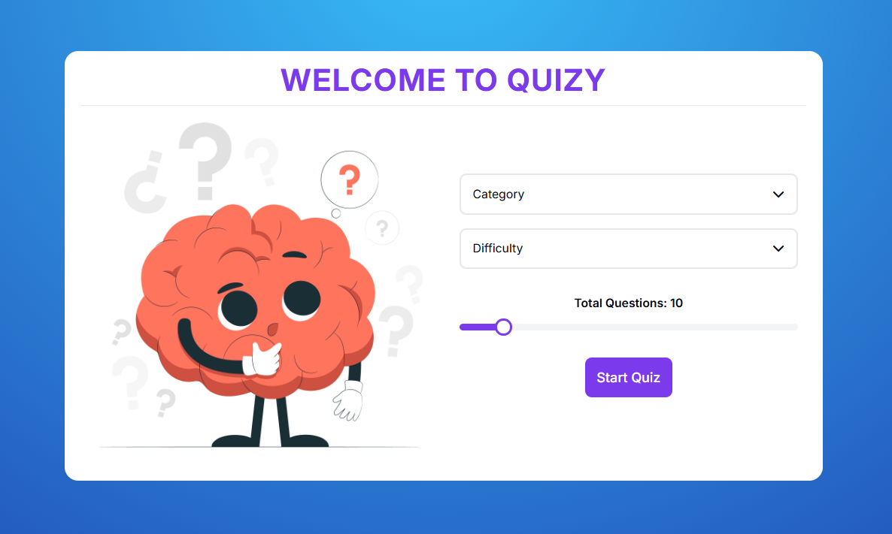

# Quiz-App
A simple Quiz App built with Vanilla JavaScript to practice core concepts like DOM manipulation, event handling, data fetching, and dynamic rendering.

### 🌐 Visit the website: [Quizy Live Demo](https://quizy-mz.netlify.app/)

## 📸 Preview

## Features

* Select question category, difficulty, and number of questions.
* Countdown timer for each question.
* Immediate answer feedback (correct/incorrect).
* Score tracking and result display.
* Responsive UI with modal dialogs for quitting or restarting.
* Animated transitions for better user experience.

## Technologies Used

* HTML
* CSS
* JavaScript (ES6+)

## Customization

* Modify the `BASE_URL` in the JavaScript file to use a different API endpoint.
* Adjust the timer duration in the `startTimer` method in the JavaScript file.
